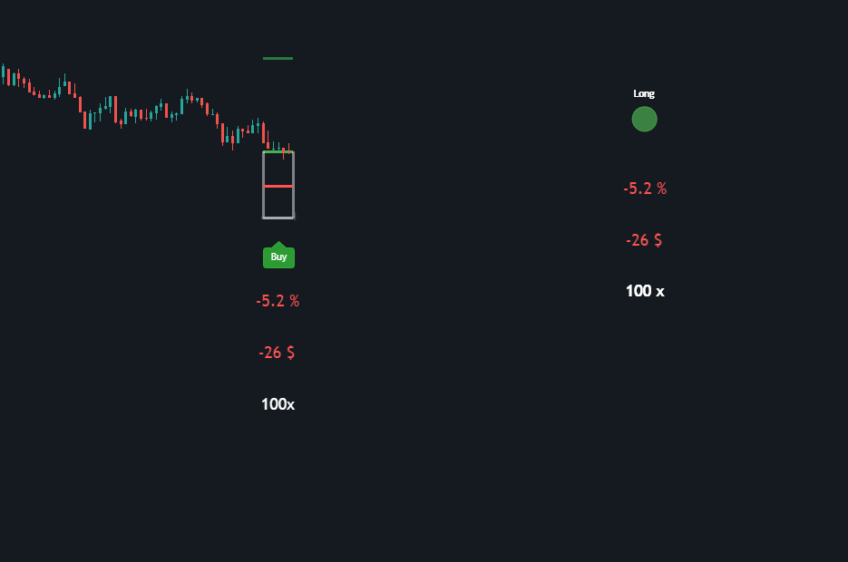

# Long & Short Position

    Developer's note:
    
    The indicators described in this document are closed-source and placed behind a pay-wall. If 
    I release the source code some day, all resources should end up here.
    
    When purchasing these indicators, you gain access to the plotted output, not the source code. 
    The indicators are written in PineScript, a language developed by TradingView. 

> ⚠️ **Important**  
> The **Flowscious** company does not take responsibility for your financial decisions. Please refer to our [Terms of Service](https://flowscious.com/terms-of-service) for more information.

## Introduction

In this documentation, you'll get more in-depth information about the indicators provided at [flowscious.com](https://flowscious.com/terms-of-service).

## 📈📉 Long & Short Position (premium) 

Click **[here](https://flowscious.com/indicators/long-and-short-position)** to navigate to the Long & Short position page at the Flowscious website.

There is already plenty of documentation available on TradingView. In this document we'll walk through some example use cases. 

### 🛡️ Risk management

Before getting into the use cases, let's talk about risk management. Most likely, it's a good practice to at least test the indicator a couple of times. To manage a position can be challenging when markets are aggressive. To mitigate the risk of losing money due to a lack of experience, there are a couple of things you can do.

1. **Simulate!** 
    - [ByBit](https://www.bybit.com/) has a perfect **demo trading** platform that allows you to trade without risking your own money. We've tried many simulated trading services, and this is the only one we've found so far that mimics reality realistically.
2. Use the replay feature in TradingView
    - This is a great system for testing overall functionality. 
    - For example, you can add the indicators in replay mode and simulate buying and selling according to your strategy. 
    - Watch how the dynamic target and stop-loss freeze the position, what type of effect different settings have, how auto leverage behaves on different time frames, etc.    

### 👌 Simplistic approach

Let's say that you have a busy day and simultaneously trying to manage an open long position. Or perhaps you want to clean the house, go to the gym, take a walk, or play an instrument. You can simply let the position indicator assist you during your well-deserved rest. Maybe you have time to engage with the charts but you just want to have some time away from the computer screen. Here's what you can do:

1. Go to TradingView
2. Press `/` on your numpad to bring up the indicators window.
3. Select the invite-only tab
    - Long Position and Short Position should be listed here if you have access.
4. Click on the chart to drop the indicator in place, make sure it's active.
    - It may take a while to load the first time.
    - The indicator should lock onto the candles and auto-adjust based on current volatility. 
    - **Note** that the default settings can be **quite aggressive**, especially on lower time frames.
5. Go to a low timeframe e.g., 10 minutes
6. Right-click on the circle indicator button, select `Add alert`, and click `Create`
    - This will trigger each `alert type` once every 10 minutes (if they execute). 
    - **Note** that alerts can be challenging to manage without previous experience.
7. Go and take a bath!
    - Depending on your settings and market movements, you may get 1-2 hours before an alert executes. 
    - For example, a `focus assist` signal attempts to alert whenever your position is heading in the right direction. You may wait for such signal before you decide to bring up the charts on your phone.
    - If you've been productive in the previous steps and also dialed in the correct position settings, here's a typical scenario: As you mind your own business, you'd casually check your notifications on your phone. You'd then follow your position with alerts such as `Long Position Is Going Above 10%!`. As the alerts become more intense, you'd take a look at the charts. 

In this way, you can minimize your time spent in front of the computer screen, but still be active and take part in market movements. 

> ⚠️ **NOTE**  
> If you have the `Dynamic Target` enabled, it will freeze the position when triggered. This will also cause alerts to stop firing. This target is designed to trigger easily, so it may be better to use a manual target in strong trends.

### 💪 Intermediate approach 

If you know the basics and want to take it a step further, here's a use case for you. In this case, we'll prepare ourselves beforehand and when preparation meets opportunity, press the button in a timely manner.

In this scenario, let's say that you're planning on managing a 10x leveraged position. 
1. Add the indicators to the chart 
    - You might slide/drag them to the latest bar for now.
2. Set leverage 
    - Open the settings, disable `Auto Leverage` and enter 10 as `Leverage`.
3. Configure the account settings
    - You can enter in your `Account` value and then either `Buy` or `Sell` a small percentage of it. But for simplicity, another approach is to type in your position size as the `Account` value and either `Buy` or `Sell` 100% of your account. This approach is easier when syncing position with simulated or real trades.
4. Hide the position 
    - Enable `Hide` and disable `PnL` to only show the indicator button at the far right.
5. Wait for your strategy to come true.
6. Open the position
    - Enable `ASAP` to get all the info you need displayed. 
    - Open a simulated position to avoid risking your own money.
    - Copy your entry price and paste it in the indicator's `Entry` input.
        - You need to disable auto entry!
    - It's a good practice to set the stop-loss initially but if you didn't do so, copy the stop-loss over to your simulated position.
        - TIP! You can easily copy the stop-loss by: 
            1. Creating a trendline at the stop-loss (bottom of the 'white box') Alt + T
            2. Shift + Drag in order to draw a straight line. 
            3. Double-click on the trendline and copy the coordinates. 
            4. Head over to your simulated position and configure the calculated stop-loss.
    - Disable `ASAP`
7. Set alerts
    - Right click on the circle indicator button, select `Add alert`, and click `Create`.
    - Please be thoughtful of which time frame you're on, as it affects how alerts execute
8. Lock the position to the current symbol (BETA)
    - If you want to look at other instruments, you might want to lock the position to the current chart. In this way, you can switch symbols while having the PnL still referencing your open position.
    - Simply enable `Symbol` and choose the correct chart.
        - **NOTE!** Often, the most accurate charts are available on TradingView but they are sometimes hard to find. For example, `BTCUSDT.P` is the symbol for trading BTC against USDT in the perpetual futures system at ByBit.   
9. Hide the position
    - This time you might want the `PnL` to be visible, but feel free to hide the position if you want to.
10. **Relax!**
    - Depending on your character, here's your moment to go out in nature, spend some time with your family, or whatever you feel like doing. If you're more of a 'type-A person', this is your moment to fine-tune your strategy, analyze charts, work out, or do something productive.
    - The indicator should act as your assistant at this point, watching over your trade while you're away.

### 🚀 Expert approach

> ⛔️ **Warning**  
> This approach can be extremely risky! Only follow these steps if you understand them perfectly. 

When trading with high leverage, you increase both your risk and reward. The risk isn't just your margin and liquidation price. There are many drawbacks when trading with high leverage. We'll list some examples below and then we'll establish some methods to mitigate or even eliminate them!

- Maintenance margin
    - Even if your liquidation price is never reached, your position can still be closed. This is an essential system that ensures that the exchange works properly. But it's not working in your favor. 
    - Often, this is set at 27% of your margin, which is a lot!
- ADL liquidation
    - If you have a golden strategy and buy the bottom with a high leverage, an exchange may close your position at some point. Again, these systems ensure that exchanges work properly, but they don't work in your favor.
- Fees
    - Fees can become overwhelming when trading with high leverage.
- stop-loss and liquidation
    - It's common to set a stop-loss either above or below your liquidation price, depending on whether you're longing or shorting. This is to avoid an expensive liquidation.
 
Some of these have an effect on your margin and to accommodate for both the maintenance margin and the stop-loss-to-liquidation margin, about **30-40% of your margin is shed off your position!**

Now, what if I told you that you can still trade with a high leverage without these drawbacks.

#### 👓 How to outsmart exchanges

The video below showcases how much margin you can gain when using this method!

> ℹ **Note**  
> This example is for the `Long Position` indicator and the steps are the same for the `Short Position` indicator but, upside-down.

1. Set a specified leverage
    - Disable auto leverage and set a specified leverage.
2. Create a reference 
    - Start by having the `Stoploss` and maintenance margin at default.
    - Draw a straight line along the bottom of the indicator (stop-loss). This is your reference to compare with.
3. Remove the margin stealers!
    - Enter the settings and change the `Maintenance Margin` to `0` and the `Stoploss` to `-100`.
    - This is the **extra margin** that soon will be yours!
4. Measure the 'stolen' margin 
    - Draw a straight line again at the bottom of the indicator, giving you `2` straight lines.
    - Draw a box fitting between the drawn lines and move it just below the line at the bottom.
5. Measure the `Desired Leverage`
    - Before proceeding, write down or memorize your initial `Leverage`.
    - Go into the settings again and decrease the `Leverage` until the `Stoploss` reaches slightly or a good amount below the box.
    - This is your `Desired Leverage`! 
6. Restore the position
    - After **configuring and enabling** the `Desired Leverage`, restore your previous initial `Leverage`.
    - You can delete the 2 lines and the drawn box now.
7. Confirm
    - To confirm, enable `ASAP`
    - The order information should show your desired leverage when `ASAP` is `ON` and your initial leverage when `ASAP` is `OFF`. 
    - With `ASAP` `ON`, disable and enable `Desired Leverage` to see how the numbers change. Your fee should be less when `Desired Leverage` is `ON`.
    - When enabling `Desired Leverage`, the ordervalue should remain the same while the 'cost' increases. This price difference is the margin you're essentially paying for. This will likely make more sense later when opening the position.
8. Open the position!
    - Here's where you may raise your eyebrows a bit. When you're ready to open a position, you'd enable `ASAP`, and instead of typing in your initial leverage, you'd type in the desired leverage.
    - The ordervalue stays the same but this time we're replacing some leverage with our own capital. So, **more capital will be at risk!**. This is why it's **crucial** to set a stop-loss. If the exchange stops you out accurately, it should be like being liquidated but minus the liquidation fees and other unwanted 'leverage side effects'.
9. Monitor the position
    - After opening the position, go back to TradingView and disable `ASAP`. 
    - **Remember!** Since you're 'secretly' trading with higher leverage, the indicator won't mirror the exchange in **percent** but it should mirror the actual **PnL**.
    - Now is a good time to set up alerts and save the chart.

💪 You have now gained: 
- 30-40% more margin
- A 100% stop-loss
- Less risk of ADL-liquidation
- Lower fees
